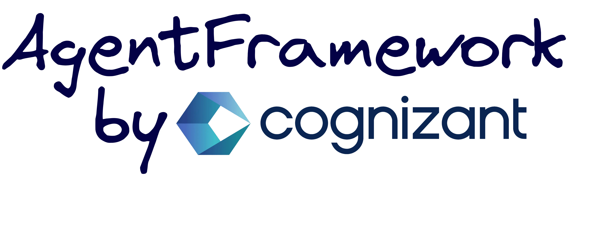
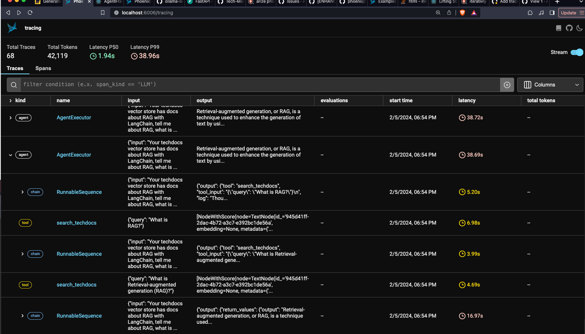

# 🏗️ AgentFramework - Pioneering the New Era of Software Agents

[](https://github.com/Tech-Modernization/AgentFramework/actions/workflows/ci.yml)



Crafted by Cognizant, `AgentFramework` stands at the forefront of software engineering innovation, challenging traditional logic constraints and introducing dynamic cognition as the new standard for service architecture.

## 🚀 **Empowering Engineers with Dynamic Agents**

`AgentFramework` is more than a toolkit—it’s a nexus of innovation. Here, developers from diverse backgrounds can create intelligent agents with the capacity for complex decision-making. By embracing dynamic cognition, our agents are equipped to surpass pre-coded logic, closely reflecting human reasoning.
- **Intelligent Orchestration**: Deploying LangChain for fluid agent orchestration.
- **Informed Interactions**: Harnessing LlamaIndex for retrieval-augmented generation, granting agents unparalleled depth and context.
- **Enterprise-Ready**: A modular, full-stack framework that adheres to best practices and industry standards for robustness.

## 🌟 **A Paradigm Shift in Product Development**

With `AgentFramework`, you're not just coding—you're sculpting the future. This robust, modular, and extensible platform is the bedrock for software services that think and act with unprecedented autonomy.

## 🔧 **Built for Builders**

We’ve laid the foundations so you can innovate with purpose. Our infrastructure supports the rapid deployment of enterprise-grade solutions, from DevOps to product launch.
- **Simplicity in Complexity**: We've made advanced agent development intuitive, turning complexity into opportunity.
- **Growth-Ready**: `AgentFramework` evolves with your ambitions, easily integrating new technologies as they emerge.
- **Community-Driven**: In the spirit of open-source collaboration, we invite contributions that drive our framework and the field of AI forward.

## 🚀 Getting Started

The following sections will provide detailed guides and instructions on how to get started with `AgentFramework`, covering prerequisites, setup, deployment, and usage. Explore the architecture, features, and customization options to build advanced conversational agents.

### Prerequisites

To use this project, you will need:

- Docker and Docker Compose installed, find docs for setup here: [Windows Setup](https://github.com/Tech-Modernization/AgentFramework/blob/main/docs/windows-setup.md), [Mac Setup](https://github.com/Tech-Modernization/AgentFramework/blob/main/docs/mac-setup.md)
- Windows Only: WSL
- An Azure OpenAI API key (Retrieved in next step)
- Make command installed
   - Mac: Comes default
   - Windows WSL: `sudo apt install make`
      - OR Install Make for Windows: https://gnuwin32.sourceforge.net/packages/make.htm
      - Note: After installing, be sure to add the bin folder to the PATH environment variable.

### Retrieve your Azure OpenAI API Key

Get from Key from Azure console
* Go to https://portal.azure.com/#home
* Navigate to OpenAI
* Click on `azure-ai-test`
* Navigate to `Keys and Endpoint` which is on the left side in the menu
* Copy Key 1 into your clipboard

If you don't have access to the Azure console ask someone else on the team for a key or go read our Gen AI CoP setup docs here: https://cognizantonline.sharepoint.com/sites/CommunitiesCognizant/_layouts/15/Doc.aspx?sourcedoc={7f18b6dc-0ea4-47eb-9d2e-e1631faa50b6}&action=edit&wd=target%28Official%20Gen%20AI%20Training%20Course.one%7C5e20da53-b8d4-44bb-8670-41c64efb9bd9%2FInitial%20Setup%20for%20Gen%20AI%20Training%7C9dea0838-c11f-4c3e-814a-2feb400628a1%2F%29&wdorigin=703

### Setup with Cog Azure OpenAI

To set up the project:

1. Clone this repository to your local machine and open in VSCode
  - Open your terminal and navigate to where you store your git repos, this could be in Documents or anywhere really
  - run `git clone git@github.com:Tech-Modernization/AgentFramework.git`
  - Now open the newly cloned down repo as a folder in VSCode

2. Please duplicate the 'key.env.example' file and rename the copy to 'key.env'. Then, insert your Azure OpenAI Key into the 'AZURE_OPENAI_API_KEY' field within the 'key.env'. Detailed guidance on obtaining this API key can be found in the preceding documentation.

3. Create needed directories for persistent storage which is used by docker compose, below command uses the default location.
   * We create three directories here.
     * Chat history to be maintained on the local file system
     * Qdrant, the VectorDB, which enables the LLM to query various documents.
     * Sqlite, which maintains a history of all the files and urls we have ingested

   ```bash
   # Run this command in the AgentFramework folder, the root of this repo
   make setup
   ```

4. Please setup pre-commit

   ```
   python3 -m pip install pre-commit
   ```

5. Build the Docker images:

   * A rebuild is required when:
      * Any key.env changes will require a rebuild
      * Sometimes new updates which have changed the docker container will require a rebuild
   * Changes to the code will hot-refresh the API


   ```bash
    make build
    ```

6. Start the services:
   ```bash
   make up
   ```
The services will now be running.

7. Optional: Run automated integration tests in another terminal to make sure everything is up and running
*Note: These integration tests will populate the vector DB with langchain docs, just be aware of this.*
```
make test-integration
```

8. Optional: SerpApi for Google searches Config
There is an optional tool for using SerpApi to query Google search API. Follow the steps in this document to configure it: [/docs/how-to-create-a-tool.md](/docs/how-to-create-a-tool.md)

## 🚢 **Deployment and Usage**
Once the Docker containers are up and running, you can start interacting with the bot via:

- The **interactive Swagger docs** at [http://localhost:8000/docs](http://localhost:8000/docs)
- The **Phoenix: AI observability & evaluation tool** at [http://localhost:6006](http://localhost:6006)
- The **ReactJS Chat Interface** at [http://localhost:3000](http://localhost:3000)
- The **Qdrant Web Interface** at [http://localhost:6333/dashboard](http://localhost:6333/dashboard)
- The **Jupyter Notebooks Interface** at [http://localhost:8888/](http://localhost:8888/)
  - Jupyter requires a Password/Token which is generated at startup. Run `docker-compose logs jupyter` and scroll to top the of logs to see this token. Ctrl+f for a log line saying `Jupyter Server 1.24.0 is running at:` and then Ctrl+click on the url `127.0.0.1:8888/lab?token-abcdefg12345....`
   - This command will find the Jupyter URl with the token and open it on Mac/Linux (untested on Windows): `make open-jupyter`

### Learn How to Chat With a Webpage
Let's learn how to give the LLM access to a webpage so you can ask questions about it. In this example you'll scrape the LangChain docs for Retrieval Augmented Generation. Once you've scraped and processed the page you can ask questions about it.


The above video shows the same steps as the are listed out below, but using some recent AWS news as an example. The recent AWS news is a good example use case because the LLM will not have knowledge of it in it's training data.

1. **Scrape Documents:**

First, scrape a webpage. Here we are scraping the LangChain docs on RAG, but it could be any webpage. You can scrape as many URLs as you'd like, one at a time. They'll all get put into the same place and you can ask about any of them.

    - Go to the FastAPI server by navigating to the interactive Swagger docs at [http://localhost:8000/docs](http://localhost:8000/docs).
    - Use the `scrape` endpoint to scrape content from a specified URL.
      - Click the `Try it out` button
      - You can use the default url provided or replace it with your own, such as a wikipedia article.
      - Click the Execute button
    - The `scrape` endpoint will return the scraped content which will be processed in the next step.


3. **Create a Vector Index:**

Now are are going to process the webpage, this process can handle any number of webpages at once.

    - Use the `process-documents` endpoint to create a vector index from the scraped content.
      - This endpoint will process the scraped documents, create a vector index, and load it into Qdrant.
      - It possible the parameters have changed since the screenshot was taken, the defaults will always be correct to use
   - Same as before, Click the `Try it out` button, leave the default values, the click the `execute` button


4. **Chat with Processed Documents:**
    - Now that the documents are processed and loaded into Qdrant, you can start interacting with them.
    - Try chatting with the documents via the ReactJS Chat Interface at [http://localhost:3000](http://localhost:3000).
    - The bot will need to be told to check the `techdocs` collection for technical information while responding to your queries.
    - Try a message like `Your techdocs vector store has docs about RAG with LangChain, tell me about RAG, give me an overview.`


There is your intro of how to import and ask questions about a web page! If you are ready for more advanced usage checkout this guide of ingesting an entire folder of documents. [Chat with Contino docs](./docs/chat-with-contino-docs.md)

### Learn How to Chat a Document
Now that you've tried a webpage, let's do the same with a document. At time of writing, AgentFramework supports pdf, pptx, docx, txt, and md files, support will get extended to new files types over time.

1. **Process pptx file into vector store**

For this example, we've already got a sample pptx file in the repo about how to write good user stories. Feel free to drag your own file into the repo though and try it instead.


   - Trigger the `process-documents` endpoint with `/app/tests/test-data/` as the `source_dir` and `.pptx` as the only extension as, shown in the image above
      - This will look for any pptx files in the directory, then atomically embed and store them in the vector DB
      - To do this:
         - Click the `Try it out` button for `process-documents`,
         - Update `source_dir` to `/app/tests/test-data/`
         - Remove all the strings except for `.pptx` from `extensions_to_process`
         - Click the `execute` button

2. **Chat with the PPTX**
Now that the PowerPoint has been process, you can ask questions about it.

- Open the React Chat UI: <http://localhost:3000/>
- Try a question like this *"You a powerpoint for teaching how to make good user stories in your tech docs vector store. Who's job is it to write user stories according to the PowerPoint?"*


## Tracing and Logging
AgentFramework comes with the [Phoenix: AI Observability & Evaluation](https://docs.arize.com/phoenix/) tool built in.



<http://localhost:6006/tracing>

## Automated Testing
Unit can be found in `backend/tests/` and integration tests in `tests/integration`. Both may be run together with `make test`


### Python Unit tests
Python unit tests are a work in progress. You may run the unit tests with the following command:

```
make test-unit
```

Tests located in `backend/tests/unit`

### React Unit tests
Run ReactJS JavaScript unit tests

```
make test-react
```

Tests located in `frontend/test`

### Integration tests
These tests use pytest to hit the FastAPI endpoints, so you must make sure you've run `make run` to bring the containers up before trying them out.

These tests will populate data into the vector store, so be aware of this. At the current time, there is no automated cleanup of this test data. In the future, once we support multiple Qdrant collections, we should make a fresh collection to isolate the test data.

```
make test-integration
```

Tests are here: `tests/integration`

### Linter
The lint command in our Makefile is designed to ensure that our codebase adheres to a consistent style and format. It utilizes the black code formatter, which automatically formats Python code to conform to a consistent style. This helps in maintaining the readability and maintainability of the code.


The lint target is defined in the Makefile to run the black code formatter inside a Docker container. This ensures that the linting process is consistent across different development environments.


```
make lint
```

## 🏗 **Architecture Overview**

The AgentFramework architecture consists of the following key components:

- FastAPI - High performance REST API framework. Handles HTTP requests and routes them to application logic.
- ReactJS - Interface for interacting with the bot via GUI.
- Qdrant - Vector database for storing document embeddings and enabling similarity search.
- AgentHandler - Orchestrates the initialization and execution of the conversational agent.
- Scraper - A tool that scrapes a web page and converts it to markdown.
- Loader - A tool that loads content from the scraped_data directory to a VectorStoreIndex
- Tools - Custom tools that extend the capabilities of the agent.


*Here is a generic overview of how these tools work together*


## ⚙️ **Bot Infrastructure**
Let's take a closer look at some of the key bot infrastructure components:


### Deploying AgentFramework
AgentFramework is a dev ready solutions accelerator. It's fully containerized which means you can bring it up with a single command locally if you have docker, meaning AgentFramework is well prepared to integrate with modern cloud operating environments. That integration still needs to occur though. You will need someone who is familiar with deploying and setting up container-based apps in the environment you're working in.

### FastAPI
FastAPI provides a robust web framework for handling the API routes and HTTP requests/responses.

Some key advantages:

- Built on modern Python standards like type hints and ASGI.
- Extremely fast - benchmarked to be faster than NodeJS and Go.
- Automatic interactive docs using OpenAPI standards.

In this project, main.py initializes the application and sets up the /chat endpoint which is the gateway for users to interact with the bot. Functionality can be tested directly via the docs interface:


### ReactJS
ReactJS serves as the interactive graphical interface allowing users to easily interact with the chatbot, providing a user-friendly way to visualize and test the bot's capabilities.


### Qdrant
Qdrant is a vector database optimized for ultra-fast similarity search across large datasets. It is used in this project to store and index document embeddings, enabling the bot to quickly find relevant documents based on a search query or conversation context.


## 🔧 **Custom Components**
### AgentHandler

`AgentHandler` is a central class, designed to initialize and manage the conversational agent within the `AgentFramework` framework. It aims to provide developers with a clear and efficient way to handle the conversational agent's components and interactions.

#### Initialization and Configuration
- **`_initialize()`:** Orchestrates the initialization of all the components required for the agent, ensuring each element is set up correctly.
- **`_setup_config_and_env()`:** Loads configurations and sets up environment variables, providing a context for the agent's operation.

#### OpenAI Model Management
- **`_setup_openai()`:** Initializes the OpenAI model based on loaded configurations. It includes error handling to log and raise exceptions if any issues occur during initialization.

#### Memory Management
- **`_setup_memory()`:** Establishes the conversation buffer memory for maintaining chat history, enabling contextual conversations.

#### Prompt Template Management
- **`_load_prompt_templates()`:** Loads the prompt templates that guide the agent's responses and handles exceptions during the loading process, logging errors for troubleshooting.

#### Agent Executor Initialization
- **`_initialize_agent_executor()`:** Initializes the `AgentExecutor`, setting up the `ZeroShotAgent` with proper configurations and tools.

#### Tool Setup and Prompt Construction
- **`_setup_tools() -> list`:** Initializes and returns the tools required for the `ZeroShotAgent`.
- **`_setup_prompt_template() -> PromptTemplate`:** Constructs and returns the prompt template for the agent based on loaded templates and tools.

#### Agent Setup and User Interaction
- **`_setup_agent() -> AgentExecutor`:** Constructs and returns the `ZeroShotAgent` with all its configurations and tools.
- **`chat_with_agent(user_input: str) -> str`:** Handles user input, manages interaction with the agent, and returns the agent's response, with error handling and logging.

#### Singleton Instance Retrieval
- **`get_agent_handler() -> AgentHandler`:** Returns the singleton instance of the `AgentHandler`, preventing unnecessary instantiations and initializations.

#### Usage Example
```python
agent_handler = get_agent_handler()
response = agent_handler.chat_with_agent("How does photosynthesis work?")
```


### Document Scraping Section

The `scraper` module, located in `/app/src/scraper/scraper_main.py`, serves as a robust utility for extracting content from web pages and converting it into structured markdown format. This module is integral for enabling the framework to access and utilize information from a plethora of web sources. Below is a succinct overview focusing on its core functionalities and workflow for developers aiming to integrate and leverage this module effectively.

#### Components:
- **WebScraper Class:**
  - Inherits from the base Scraper class and implements the Singleton pattern to ensure a unique instance.
  - Orchestrates the entire scraping process, from fetching to parsing, and saving the content.
  - Leverages `ContentParser` to extract and convert meaningful data from HTML tags into markdown format.

- **ContentParser Class:**
  - Designed to parse and convert meaningful content from supported HTML tags into markdown format.
  - Supports a variety of HTML tags including paragraphs, headers, list items, links, inline code, and code blocks.

#### Workflow:
1. **URL Validation:**
   - The provided URL undergoes validation to ensure its correctness and accessibility.
   - If the URL is invalid, the process is terminated, and an error message is logged.

2. **Content Fetching:**
   - Content from the validated URL is fetched using HTTP requests.
   - Utilizes random user agents to mimic genuine user activity and avoid potential blocking by web servers.
   - If the content fetching fails, the process is halted, and an error message is logged.

3. **Content Parsing:**
   - The fetched content is parsed using BeautifulSoup, and the `ContentParser` class is employed to extract meaningful data.
   - The parsed data includes the title, metadata, and the content in markdown format.

4. **File Saving:**
   - The parsed content is saved to a file, the filename is generated using a hash of the URL.
   - The file is stored in a pre-configured data directory.
   - If the file saving fails, an error message is logged.

5. **Result Return:**
   - Upon the successful completion of the scraping process, a success message and the filepath of the saved content are returned.
   - If any step in the process fails, an appropriate error message is returned.

#### Usage:
Developers can initiate the scraping process by invoking the `run_web_scraper(url)` function with the desired URL. This function initializes a `WebScraper` instance and triggers the scraping process, returning a dictionary containing the outcome of the scraping process, including messages indicating success or failure and the location where the scraped data has been saved.

#### Example:
```python
result = run_web_scraper("http://example.com")
if result and result.get("message") == "Scraping completed successfully":
    print(f"Scraping complete! Saved to {result['data']}")
else:
    print(result["message"])
```

### Document Loader Section

The `DocumentLoader` class, located within your project structure, is a pivotal component designed to load, embed, and index documents from a specified source directory into a Qdrant collection. This class is crucial for developers looking to manage and utilize a collection of documents efficiently within the framework. Below is a concise overview of its core functionalities and workflow to aid developers in integrating and leveraging this class effectively.

#### Components:
- **QdrantCollectionManager Class:**
  - Manages Qdrant collections, ensuring their existence or creating them as needed.
  - Interacts with the `QdrantClient` to perform operations on the collections.

- **DocumentLoader Class:**
  - Initializes with a source directory, collection name, configuration, and embedding model.
  - Loads documents from the source directory and indexes them into the specified Qdrant collection.
  - Moves the loaded documents to an output directory after successful indexing.

#### Workflow:
1. **Initialization:**
   - The `DocumentLoader` initializes with a specified source directory and collection name.
   - Loads configurations and sets up environment variables.
   - Initializes the embedding model and Qdrant client.
   - Ensures the existence of the specified Qdrant collection or creates it if it doesn’t exist.

2. **Document Loading and Indexing:**
   - Reads documents from the source directory using `SimpleDirectoryReader`.
   - Embeds and indexes the documents into the specified Qdrant collection using `VectorStoreIndex`.
   - If any error occurs during this process, it is logged, and the error is raised.

3. **File Movement:**
   - After successful loading and indexing, the documents are moved from the source directory to an output directory.
   - If the output directory doesn’t exist, it is created.

#### Usage:
Developers can instantiate the `DocumentLoader` class with the desired source directory and collection name and call the `load_documents` method to load, embed, and index the documents into the specified Qdrant collection. After successful indexing, the documents are moved to an output directory.

#### Example:
```python
document_loader = DocumentLoader(source_dir='/path/to/documents', collection_name='mycollection')
index = document_loader.load_documents()  # This will load, embed, and index the documents and then move them to the output directory.
```

### Document Search Section

The `DocumentSearch` class is a component of the framework that is designed to facilitate document searches within a specified collection using a vector store index. This class is integral for developers aiming to implement and leverage efficient document retrieval functionalities within the framework. Below is a succinct overview of its core functionalities and workflow to assist developers in understanding and integrating this class effectively.

#### Components:
- **DocumentSearch Class:**
  - Initializes with a specified collection name and user input query.
  - Sets up the vector store index and performs searches on it based on the user input query.
  - Handles exceptions and logs errors during the index setup and document search processes.

#### Workflow:
1. **Initialization:**
   - The `DocumentSearch` initializes with a specified collection name and user input query.
   - Loads configurations and sets up environment variables.
   - Initializes the Qdrant client and embedding model.

2. **Index Setup:**
   - Sets up the vector store index for the specified collection using `QdrantVectorStore` and `ServiceContext`.
   - If any error occurs during this process, it is logged, and the error is raised.

3. **Document Search:**
   - Performs a search on the set up index based on the user input query using the query engine.
   - Logs the response received from querying the index.
   - If any error occurs during this process, it is logged, and the error is raised.

#### Usage:
Developers can instantiate the `DocumentSearch` class with the desired collection name and user input query and call the `search_documents` method to perform a search on the specified collection and retrieve documents based on the user input query.

#### Example:
```python
document_search = DocumentSearch(collection_name='mycollection', user_input='my query')
response = document_search.search_documents()  # This will perform a search on the specified collection and return the response.
```

### Tools Module Overview

The `tools` module is designed to enhance the agent's capabilities by integrating external libraries, APIs, and custom functionalities. It serves as a practical extension point for developers looking to customize and extend the agent's abilities.

#### Key Features:
- **Integration of External Libraries and APIs:**
  - The module allows for the incorporation of various libraries and APIs, enabling the agent to access and leverage external functionalities and data.

- **Contextual Conversations:**
  - Tools like `SerpAPI` and `DocumentSearch` enable the agent to access real-time, relevant information, allowing for more informed and context-aware conversations.

#### Included Tools:
1. **SerpAPI Search Wrapper:**
   - Conducts Google searches to retrieve real-time search results programmatically.
   - Useful for obtaining current and relevant web information for user queries.

2. **Document Searcher:**
   - Queries specialized vector stores like ‘TechDocs’ for technical documentation.
   - Useful for addressing technical inquiries by providing relevant context and information.

#### Customization and Extension:
- Developers can modify existing tools or create new ones to meet specific needs, allowing for a high degree of customization and adaptability.

#### Usage:
The `ToolSetup` class is used to initialize and set up tools. Developers can leverage this class to equip the agent with a variety of tools that can be invoked based on the conversational context to enhance the agent's responses.

#### Evolution:
The `tools` module is dynamic and can be continually refined and expanded. Developers are encouraged to explore new integrations and enhancements to keep improving the agent's capabilities.

## 🛠️ **Prompt Engineering**

Prompt Engineering is a pivotal process in developing conversational agents, focusing on optimizing the prompts sent to Language Models (LLMs) to elicit desired responses. It involves utilizing template files and leveraging platforms and resources to refine interactions with LLMs.

Developers should leverage the template files and the LangSmith platform along with the additional resources to enhance the prompt engineering process, ensuring optimized interactions with LLMs and refined conversational experiences.

### Template Files
The project incorporates three template files located in `/app/src/template` to define the interaction dynamics:
1. **prefix.txt:** Defines the bot's personality and tool access.
2. **react_cot.txt:** Outlines the chain of thought reasoning.
3. **suffix.txt:** Allocates space for the agent scratchpad, memory, and user input.

### LangSmith Platform
[LangSmith](https://smith.langchain.com) is an integral platform designed to assist developers in building, debugging, testing, evaluating, and refining LLM-powered applications. It provides a suite of tools focusing on visibility, workflows, and extensibility, making it an indispensable resource for developing production-ready LLM applications.

#### Key Features:
- **Debugging:** Full visibility into prompts and responses, latency and token usage tracking, and a playground UI for tweaking prompts.
- **Testing:** Allows the creation and running of chains/prompts over datasets for manual review.
- **Evaluating:** Integrates with open-source evaluation modules.
- **Monitoring:** Tracks system metrics and user interactions, and associates user feedback with model runs.
- **Unified Platform:** Connects workflows and allows export of logs and datasets for integration with other tools.


### Additional Resources
Developers are encouraged to explore the following resources for more insights and guidance on prompt engineering:
- [Prompting Engineering Guide](https://www.promptingguide.ai/): An educational project by DAIR.AI focusing on prompt engineering.
- [LangChain Hub](https://smith.langchain.com/hub): A centralized platform for managing prompts.

## Additional Troubleshooting Steps

### Run only 1 test
Use the following example in the make file then run `make test-1`

```
test-1: ## Run only integration tests
	docker exec -it AGENT_FRAMEWORK_FASTAPI pytest -v tests/integration -k test_process_pptx_doc
```

### Run tests outside of docker
*Warning: unsupported path*
*Warning: These docs have been started but this hasn't actually been made to work yet*

If you'd like to run the tests outside of docker then you can use the below commands. This isn't a supported path, so it may break. If you try this and it doesn't work, try to fix it and update the docs

Install deps so you get the packages needed to run pytest, this will install all the other stuff too
```
# Create venv
python -m venv .venv

# Activate the venv (Mac)
source .venv/bin/Activate

# Activate the venv (Linux)
source .venv/bin/activate

# Activate the venv (Windows)
# ToDo: Write command for Windows

# Install the needed packages
pip install -r backend/requirements.txt --upgrade
```

Run the integration tests
```
# ToDo: test rely on docker internal dns, try to fix this
pytest -v /app/tests/integration
```


### Run The API bare metal
Run the API on the local machine, not in a container:
```
# Create venv
python -m venv .venv

# Activate the venv (Linux / Mac)
source .venv/bin/Activate

# Activate the venv (Windows)
# ToDo: Write command for Windows

# Install the needed packages
pip install -r backend/requirements.txt --upgrade

# Install some stuff and set some stuff
export NLTK_PATH="src/ingestor/nltk_data"
python3 -m pip install nltk
python3 -c "import nltk; nltk.download('punkt', download_dir='src/ingestor/nltk_data/punkt')"
python3 -c "import nltk; nltk.download('averaged_perceptron_tagger', download_dir='app/ingestor/nltk_data/averaged_perceptron_tagger')"

# Launch fastapi
uvicorn src.main:app --log-level debug --host 0.0.0.0 --port 8000 --reload

# In another terminal Startup qdrant container
docker-compose up qdrant

```

Now update the qdrant url in config.yml to
```
Qdrant:
  # url: "http://AGENT_FRAMEWORK_QDRANT:6333"
  url: "http://localhost:6333"
```

## 🚧 **Customization and Extendability**
While the project provides a solid architecture, there are ample opportunities for customization and extensibility:

- Data Sources - Integrate additional knowledge sources like databases, internal company documents etc.
- Models - Experiment with different language models based on your conversational requirements.
- Tools - Build new tools to extend the agent's capabilities like calendars, weather data, translations etc.
- Prompts - Refine and optimize prompts for your chatbot's persona and use cases.
- Visual Interface - Develop custom graphical interfaces tailored to your needs.
- API Integration - Build on top of the FastAPI backend to integrate with other services.
