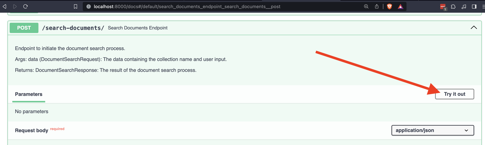
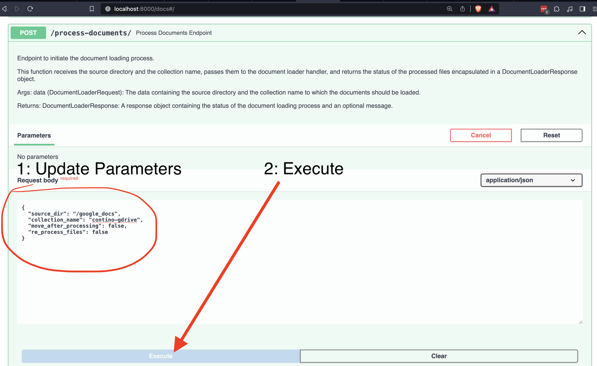
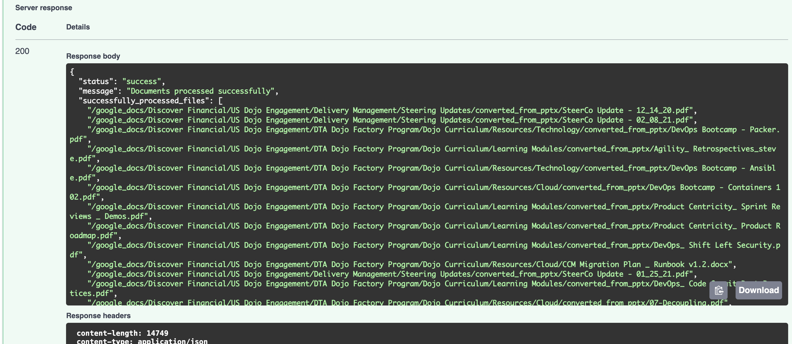

# Chat with the Contino Docs

## Current docs locations:

* Shared Google drive docs have not been moved, they are still in: https://drive.google.com/drive/u/1/folders/0APOWmanbJbbqUk9PVA
  * If you cannot access these but need to you may have to request access in the Tech Mod teams channel

* Conflence Docs: These have also not been moved
  * UK folks still have access. We can try to ask them for temp access or to scrape the docs for us

## Prepare the Vector Store with Contino Google Docs

### Option 1: Download and Mount pre-made Qdrant collection
*ToDo: Upload a premade qdrant collection somewhere*

*ToDo: Document how to import a premade qdrant collection*

### Option 2: Create a new Qdrant collection and reprocess files
*| **WARNING:** there are a lot of files. If you intend to process all the many gigs of Contino docs this can be expensive and take a while.* Please use option 1.

#### Mount files to docker container
First, ensure you know the location of all the files you'd like to embed. If you downloaded several folders from the Contino google Drive, unzip these and put them into one directory

Modify the `docker-compose.yml` file to add your directory to the fastapi container's volumes

Example from my machine is below:
```
services:
  fastapi:
    depends_on:
      - qdrant
    build:
      context: .
      dockerfile: Dockerfile.fastapi
    image: agent_framework_server_image
    container_name: AGENT_FRAMEWORK_FASTAPI
    ports:
      - "8000:8000"
    environment:
      - LOG_LEVEL=debug
    volumes:
      - ./:/app
      - /Users/920279/Documents/google_docs:/google_docs # HERE IS THE NEW VOLUME
```


### Process the Files

First, start or restart AgentFramework
```
make restart
```

Open the Open AI spec at <http://localhost:8000/docs>

Open up the /process-documents/ endpoint and click the `Try it out` button



Edit the example API call to
* Point to the correct source_dir which has your files
* Set move_after_processing to false so that AgentFramework doesn't attempt to move the source files

Here is my call:
```
{
  "source_dir": "/google_docs",
  "collection_name": "techdocs",
  "move_after_processing": true,
  "re_process_files": false
}
```

Now click the big blue `Execute` button and wait for processing to finish. You can watch the docker logs in your terminal or docker desktop as this may take a while.



Check the response to make sure all the documents you expect to have been processed have, there will be a list of files which were not processed that you can check.



## Chat with the documents

Now that you've loaded the documents into Qdrant, you can chat with them.
